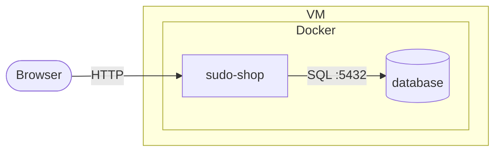

# sudo-shop

## Session 1
### Shop-Konzept und begründete Technologieauswahl; Plattformname und Hosting-Rechner benannt. 
- Docker
- SvelteKit
- Postgres

### Erste überprüfbare Anforderungen und grobe Architekturskizze. 

**Anforderungen**
- Shop läuft via `docker compose up` auf dem Ubuntu-Server (Proxmox) und ist im internen Netz erreichbar.
- Nutzer können sich registrieren, einloggen, Produkte ansehen und bestellen.
- Je OWASP-Kategorie mindestens eine lösbare Challenge mit Flag:
  - A01: Fremde Bestellung über `/orders/[id]` abrufbar (IDOR).
  - A05: Produktsuche per Cross-Site Scripting (XSS) ausnutzbar.
  - A06: Bestellung mit negativer Menge senkt den Gesamtpreis.
- Jede Challenge dokumentiert CWE (ggf. CVE) mit offizieller Quelle.
- Quellcode liegt auf GitHub, Lehrperson hat Zugriff.
- Software, Doku und Präsentation fertig bis 6. November 2026.

**Architektur**

### Drei OWASP-Kategorien und Challenge-Ideen mit genauen CWE-/CVE-Zuordnungen und Quellen. 
| Kategorie | Challenge | CWE | Quellen |
|---|---|---|---|
| A01:2025 Broken Access Control | IDOR: Bestell-ID in `/orders/[id]` ändern, um fremde Bestellungen (mit Flag) zu sehen | CWE-639 | [OWASP](https://owasp.org/Top10/2025/A01_2025-Broken_Access_Control/), [CWE-639](https://cwe.mitre.org/data/definitions/639.html) |
| A05:2025 Injection | Reflektiertes XSS in der Produktsuche: Suchbegriff wird ungefiltert ausgegeben, eingeschleustes Script gibt das Flag frei | CWE-79 | [OWASP](https://owasp.org/Top10/2025/A05_2025-Injection/), [CWE-79](https://cwe.mitre.org/data/definitions/79.html) |
| A06:2025 Insecure Design | Negative Menge im Warenkorb senkt den Gesamtpreis, um das „Flag-Produkt“ gratis zu kaufen | CWE-1284 | [OWASP](https://owasp.org/Top10/2025/A06_2025-Insecure_Design/), [CWE-1284](https://cwe.mitre.org/data/definitions/1284.html) |

